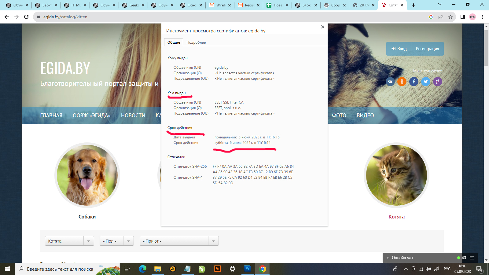
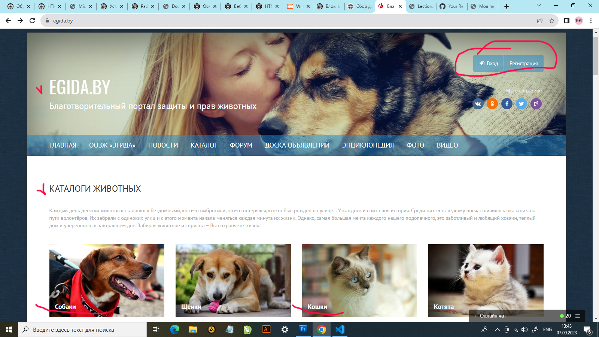
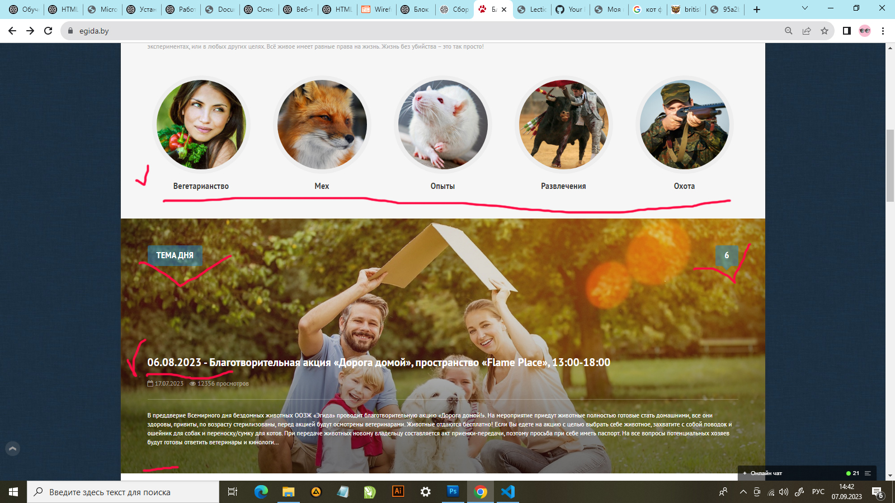

# GB_repos_06.09.23

Сайт:  EGIDA.BY
ссылка:     https://egida.by/catalog/kitten

Протокол: HTTPS

Общее имя: (CN)	ESET SSL Filter CA

Организация: (O)	ESET, spol. s r. o.

Дата выдачи:	понедельник, 5 июня 2023 г. в 11:16:15

Срок действия:	суббота, 6 июля 2024 г. в 11:16:14

               
               
# СТРУКТУРА САЙТА #

## Шапка ##

В шапке сайта располагается название сайта и его меню.

 В правой части две кнопки: вход на сайт и регистрация. 

## Зона контента  ##

В зоне контента один за другим распологаются 3 блока, в каждом меню с фотографиями.

1. КАТАЛОГИ ЖИВОТНЫХ

2. ЭТИЧНОЕ ОТНОШЕНИЕ К ЖИВОТНЫМ

3. ТЕМА ДНЯ

Затем идёт блок, разделённый на левую сторону (эта часть занимает чуть больше половины экрана) в которой представлены "ПОСЛЕДНИЕ НОВОСТИ".
Они в свою очередь разделены на определённую новость с фото и описанием, и правую сторону (чуть меньше половины экрана) в которой представлены "МНЕНИЯ".

В самом низу зоны контента располагается два блока:

* Энциклопеция

* Фото

## Подвал ##

В подвале сайта указано, что это благотворительный портал защиты и прав животных EGIDA.BY © 2006-2023. Частный независимый интернет-проект. Перепечатка материалов разрешена только с указанием обратной ссылки на www.egida.by

Так же указаны реквизиты куда можно сделать пожертвование, контакты, адреса для писем и ООЗЖ «Эгида» в социальных сетях со значками соцсетей, для быстрого перехода.

# ИЗМЕНЕНИЯ #

# Прототип низкой детализации #

